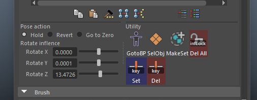

# CutomWeightPainter
カスタムウエイトペインターはMaya標準のウエイトペイントToolの機能を拡張したToolです。

基本、通常のMaya標準のウエイトペイントToolと同様に使用することができますが、一緒にいくつかの便利な機能を使うことができます。

## installation
### インストール方法
まず、CustomWeightPainterのルートフォルダを任意の場所に配置してください。

次に、installer.pyをMayaのモデルエディタ上にドラッグ＆ドロップしてください。

すると、その時表示されているシェルフにボタンが追加されます。

**！注意！**  
installer.pyと「CustomWeightPainter」フォルダは同じ階層にしておく必要があります。

## 使い方
基本的な使用方法はMaya標準のウエイトペイントToolと同じです。  
スキンバインド済みのモデルメッシュを選択し、インストールしたシェルフボタンをクリックしてToolを立ち上げます。

このとき、カスタムUIが追加されれば、問題なく起動完了しています。

### 便利な機能
#### 1) ジョイントの回転機能
ウエイトペイントToolで選択しているインフルエンスオブジェクト（ジョイント）を回転することができます。  
ジョイントの回転は、アトリビュートスライダーを使って、rotateX,Y,Zそれぞれに対して操作して行います。

そのとき、Pose actionラジオボタンの選択状態によって、アクションが異なります。
- Holdモード
  - ジョイントの回転後、回転状態を保ちます。
- Revertモード
  - このToolは、インフルエンスを選択したときの初期回転値を記憶してあります。
  - Revertモードにすると、回転後、元の回転値に戻ります。
- Go to Zero
  - 回転後、値をゼロにします。

このジョイントの回転機能を経由してジョイントを回転させた場合、Mayaの状態がAutoKeyFrame状態であっても無視して、キーフレームを設定しません。  
勝手にアニメーションを振られたくない場合に、安心して回転させることが可能です。

#### アトリビュートスライダーの右クリックメニュー
ジョイントを動かすfloatSliderはmelの「attrFieldSliderGrp」を使っています。  
そのため、右クリックメニューから各種アトリビュートに対する処理が可能です。  

  
この右クリックメニューはアトリビュートエディタからアトリビュートを右クリックした際に出るメニューと同じです。

- セット キー
- アトリビュートのロック

そのほかにも、以下の標準機能が使用可能です。
- expressionの作成
- セット ドリブンキー
- UtilityNodeの接続

#### Utility機能
1. GotoBP  
     
   選択オブジェクトをバインドポーズに戻します。  
   MayaのAutoKeyFrameの状態は無視するので、キーフレームは設定されません。
2. SelObj  
     
   選択オブジェクトを選択しなおします。  
   インフルエンスメニューの右クリックから頂点選択などをした後で、「オブジェクト選択状態にもどしたいなぁ…」という状況で便利です。
3. MakeSet  
     
   Quick Selection setを作ります。  
   Maya標準のQuick selection setの作成フローに処理を飛ばしているので、シェルフに選択セットを登録することもできます。
4. Del All(inflence lock)  
     
   現在ペイント可能なすべてのインフルエンスオブジェクトに対し、
   - インフルエンスのロックを解除
   - もしもインフルエンスのロックアトリビュートにキーフレームが振られていた場合、それらのキーをすべて削除します。
  
   ウエイト作業をしていて、誤ってインフルエンスのロックにアニメーションキーを振ってしまった場合に便利です。
5. Set(key)  
     
   選択インフルエンスのrotateに対して３軸のキーフレームを設定します。  
   アトリビュートスライダーの右クリックからキーフレームを設定することも可能ですが、手っ取り早く行うのに便利です。
6. Del(key)  
     
   選択インフルエンスのrotateに対して３軸のキーフレームをすべて削除します。  
   アトリビュートスライダーの右クリックからキーフレームを削除することも可能ですが、手っ取り早く行うのに便利です。

# 更新履歴
- 2025/2/7 v1.0.1リリース
  - hotfix: 【不具合修正】 「ウエイトペイントToolとは違う別のToolのプロパティウインドウを表示したのち、当Toolを起動しようとするとエラーになって起動しない」 
- 2025/1/8 v1.0.0リリース